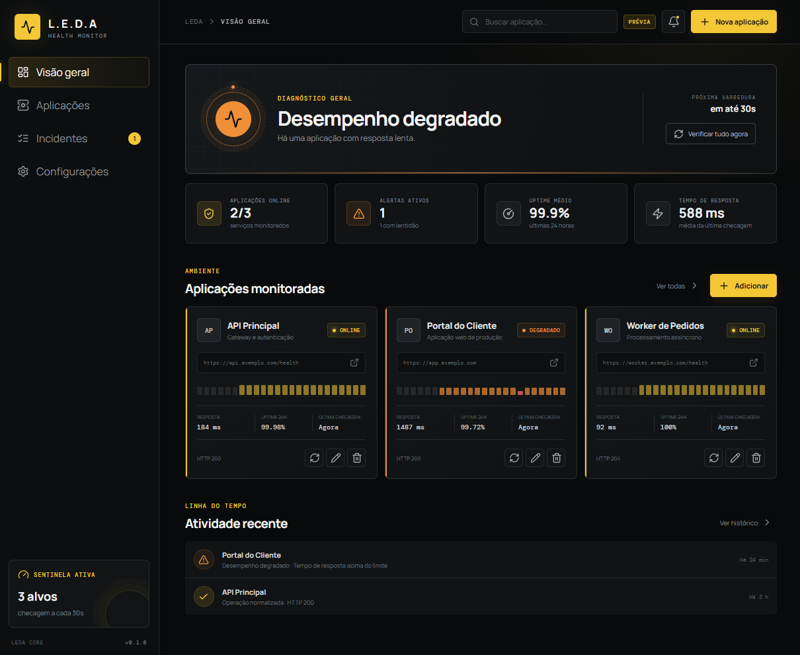

<div align="center">


# L.E.D.A

### Live Environment Diagnostic Assistant

Monitoramento local, contínuo e visual da saúde das suas aplicações.

</div>



## Sobre o projeto

A **L.E.D.A** é uma sentinela desktop para Windows que acompanha endpoints HTTP/HTTPS, identifica indisponibilidade ou lentidão e mantém você informado sobre o estado das suas aplicações.

As verificações continuam em segundo plano mesmo quando a janela é fechada. A L.E.D.A permanece minimizada na bandeja do sistema, de onde você pode abrir o painel, disparar uma nova varredura ou encerrar o monitor. Quando uma aplicação cai, apresenta degradação ou volta ao normal, a L.E.D.A pode emitir uma notificação nativa do Windows.

## Principais recursos

- Painel desktop responsivo com identidade visual em preto, prata e amarelo
- Cadastro, edição, pausa e remoção de aplicações
- Verificação por código de status HTTP
- Validação opcional de texto no corpo da resposta
- Estados **operacional**, **degradado**, **indisponível** e **pendente**
- Histórico das últimas 180 verificações por aplicação
- Uptime médio das últimas 24 horas
- Medição do tempo de resposta
- Linha do tempo de mudanças de estado
- Notificações nativas do Windows
- Execução contínua em segundo plano
- Inicialização automática junto com o Windows, iniciando minimizada na bandeja do sistema
- Armazenamento local, sem envio de dados para serviços externos

## Como funciona

1. Você cadastra o endereço de saúde da aplicação, como `https://api.exemplo.com/health`.
2. A L.E.D.A consulta esse endereço no intervalo configurado.
3. O status HTTP, o conteúdo da resposta e a latência determinam a saúde do serviço.
4. Cada resultado alimenta o histórico, as métricas e os alertas do painel.

## Endpoint de health check

A aplicação monitorada precisa disponibilizar um endpoint HTTP. Uma resposta saudável pode ser tão simples quanto:

```http
HTTP/1.1 200 OK
Content-Type: application/json
Cache-Control: no-store
```

```json
{
  "status": "UP",
  "service": "api-pedidos",
  "timestamp": "2026-07-13T13:30:00Z"
}
```

Em caso de falha crítica, o endpoint deve preferencialmente retornar HTTP `503` e o estado `DOWN`.

O [manual de health check](docs/HEALTH-CHECK.md) contém um roteiro completo e um prompt pronto para pedir a implementação desse endpoint em outras aplicações.

## Cadastrando uma aplicação

Na tela **Nova aplicação**, informe:

| Campo | Exemplo | Obrigatório |
| --- | --- | :---: |
| Nome | `API de Pagamentos` | Sim |
| URL | `https://api.exemplo.com/health` | Sim |
| Descrição | `API utilizada pelo checkout` | Não |
| Status esperado | `200` ou `200-299` | Sim |
| Texto esperado | `UP` | Não |

São aceitas URLs `http://` e `https://`. O status esperado pode conter códigos isolados, intervalos ou combinações, como `200`, `200-299` ou `200, 204, 300-399`.

## Executando em desenvolvimento

Requisitos:

- Windows 10 ou 11
- Node.js 20 ou superior
- npm

Instale as dependências e abra o aplicativo:

```powershell
npm install
npm run dev
```

## Testes e build

```powershell
# Executa os testes automatizados
npm test

# Compila a interface
npm run build

# Gera o instalador do Windows
npm run build:win
```

O instalador é gerado em `release/LEDA-Setup-<versão>.exe`.

## Estrutura do projeto

```text
L.E.D.A/
├── electron/       # Processo desktop, monitoramento e integração com o Windows
├── src/            # Interface React
├── tests/          # Testes automatizados do monitor
├── docs/           # Manuais e imagens
├── index.html      # Entrada da interface
└── package.json    # Scripts e configuração do instalador
```

## Configurações disponíveis

- Intervalo entre verificações: de 10 a 3600 segundos
- Tempo limite da requisição: de 1000 a 30000 ms
- Limite para considerar uma resposta lenta: de 100 a 30000 ms
- Inicialização automática com o Windows
- Ativação ou desativação das notificações do sistema

## Privacidade

As URLs, configurações, verificações e ocorrências ficam armazenadas no arquivo `leda-data.json`, dentro da pasta de dados local do aplicativo. A L.E.D.A não envia essas informações para serviços externos.

## Licença

Distribuído sob a licença MIT. Consulte [LICENSE](LICENSE).
